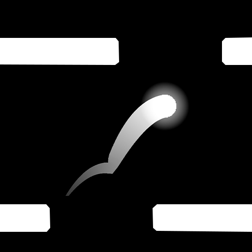
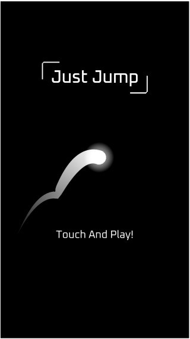
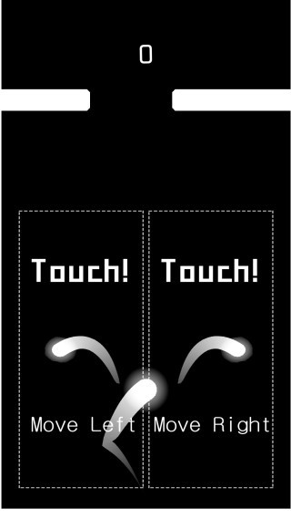
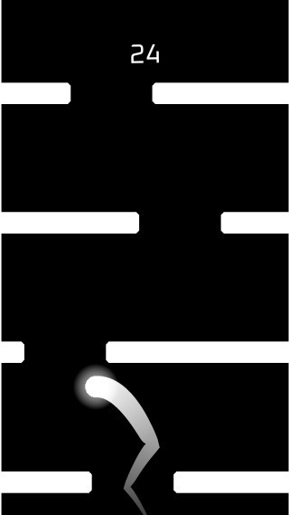
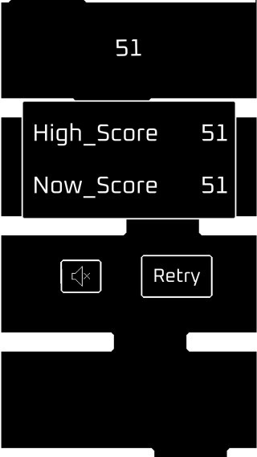

# Just Jump
> ## 목차
 - [게임소개](#Infomation)
 - [게임화면](#게임화면)
 - [사용기술](#사용한-기술-및-배운점)
 - [개선점](#개선점)
___
> ## Infomation
  

|||
|:--:|:--|
|이름|Just Jump|
|설명|화면의 좌우를 터치하고 지형들을 피해 가장 높은 점수를 획득하는 게임|
|특징|간단하고 단순한 조작과 인터페이스|
|제작기간| 20년03월10일 ~ 20년03월15일 (5일)|
|초기목표|간단한 조작으로 중독성을 느낄 수 있는 캐주얼 게임 제작|
|에셋|대부분 제작, 일부 에셋들은 Unity Asset Store에서 사용|
|자세한 제작과정| X |
|다운로드 링크|[Google Play](https://play.google.com/store/apps/details?id=com.NAMAAN.JustJump)|
|영상 링크|[YouTube](https://youtu.be/_vzkCvz7NtQ)|
___
> ## 게임화면
|__ScreenShot__||||
|:--:|:--:|:--:|:--:|
|||||
___
> ## 사용한 기술 및 배운점
  - 싱글톤을 몰라 하나씩 끌어다가 사용
  - 구글 애드몹 사용법
    - 배너만 구현, 다른것들은 구현 못했다. 
    - 배너는 항상 게임화면 아래에 출력
  - PlayerFabs 사용법
    - 모든 데이터를 PlayerFabs를 사용
    - 보안에 취약
  - PlayStore 출시 관련 필요한 자료들
    - 아이콘, 출시 과정 등등
    - 출시 검사 오랜 시간 소유 (약 1주일) 

___
> ## 개선점
  - 지형의 지루함
    - 장애물 생성 수정(거리등...) 
  - 오브젝트풀링을 사용한 가비지값 삭제
  - 공의 postion값이 상승하기 때문에 오류 발생